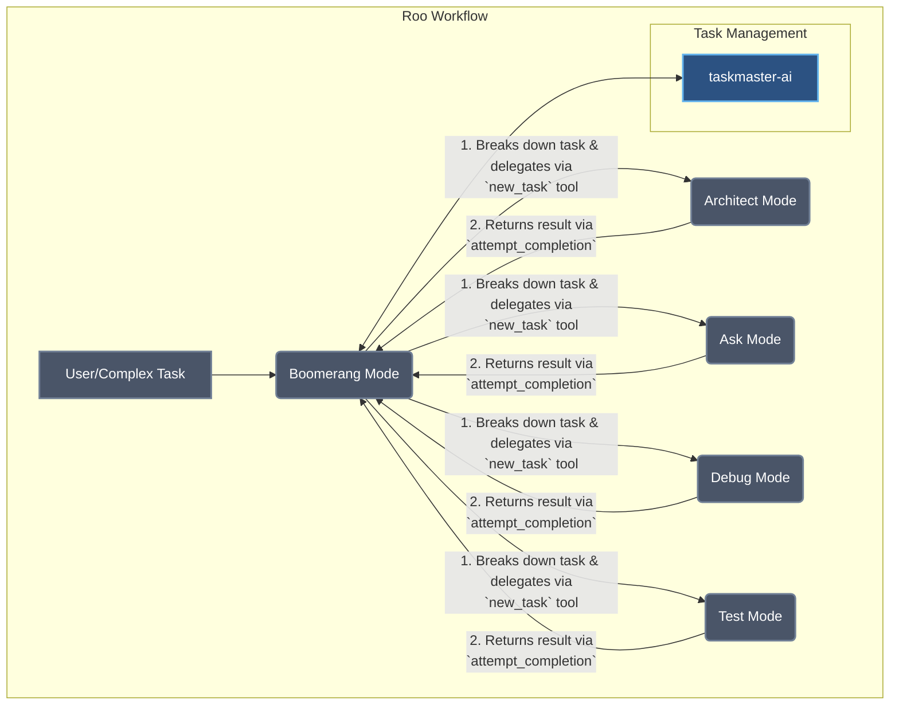
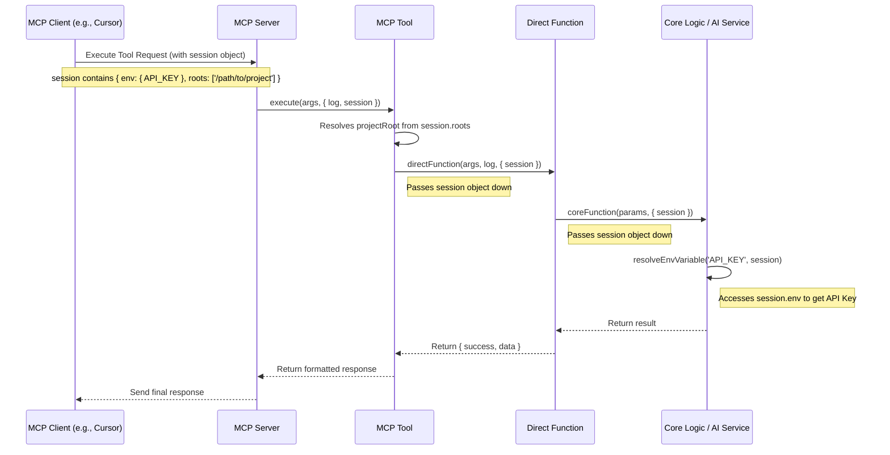

# Understanding the Roo Workflow

This document provides an overview of "Roo," a multi-modal AI assistant persona configured in this repository. The core configuration for Roo and its modes can be found in [`assets/roocode/.roomodes`](mdc:assets/roocode/.roomodes).

## What is Roo?

"Roo" is a strategic AI orchestrator designed to manage complex workflows by delegating tasks to a suite of specialized modes. Instead of being a single, general-purpose assistant, Roo acts as a project manager, using the `taskmaster-ai` CLI as its central system for defining, assigning, and tracking work.

The entire system is defined in the [`.roomodes` configuration file](mdc:assets/roocode/.roomodes).

## Roo Workflow vs. Direct CLI Usage

It is critical to understand the distinction between the Roo workflow and using the `task-master` CLI directly in your terminal.

*   **The Roo Workflow is for AI Agents via MCP**: The entire "Roo" concept, with its specialized modes (Boomerang, Architect, etc.), is a blueprint for how an **AI agent** (like the one in Cursor) should behave. This agent requires a programmatic and structured way to interact with the Task Master system, which is what the **MCP server** provides. The agent uses the MCP tools (`list_tasks`, `add_task`) to execute the steps defined in the Roo instructions.

*   **The CLI is for Human Users**: The command-line interface (`task-master ...`) is designed for **you**, the human developer. When you run `task-master list` or `task-master next` in your terminal, you are directly interacting with the core logic. In this scenario, **you** are the orchestrator, deciding which commands to run and in what order.

In short, the Roo workflow does not apply when you are using the CLI directly. It is exclusively for agent-based interaction through the MCP server.

## Workflow Diagram

The following diagram illustrates how the primary "Boomerang" mode orchestrates tasks among the specialized modes.

## Roo Modes Explained

Each mode has a specific role, a set of instructions, and access to a defined group of tools. All modes are configured in [`assets/roocode/.roomodes`](mdc:assets/roocode/.roomodes).

### 1. Boomerang (The Orchestrator)
-   **Role**: The central coordinator. It receives complex tasks, breaks them down into manageable subtasks using `taskmaster-ai`, and delegates them to the most appropriate specialized mode.
-   **Key Function**: Manages the entire lifecycle of a complex request, from decomposition to final integration of results.
-   **Tools**: Has broad access to `read`, `edit`, `browser`, `command`, and `mcp` tools.

### 2. Architect
-   **Role**: An expert technical leader focused on system design, architecture, and implementation planning.
-   **Key Function**: Analyzes requirements, creates technical designs (including Mermaid diagrams), and plans execution steps. It does not write production code but rather sets the blueprint for it.
-   **Tools**: `read`, `edit` (for `.md` files), `command`, `mcp`.

### 3. Ask
-   **Role**: A technical assistant for research and explanation.
-   **Key Function**: Answers specific, delegated questions by analyzing code or searching the web. It provides concise answers and explanations.
-   **Tools**: `read`, `browser`, `mcp`.

### 4. Debug
-   **Role**: A specialist in diagnosing and resolving software issues.
-   **Key Function**: Follows a systematic debugging process: analyze the request, form hypotheses, use diagnostic tools to investigate, and report the root cause.
-   **Tools**: `read`, `edit`, `command`, `mcp`.

### 5. Test
-   **Role**: A dedicated software tester.
-   **Key Function**: Executes test plans, primarily based on the `testStrategy` defined in a `taskmaster-ai` task. It reports results, including pass/fail status and bug details.
-   **Tools**: `read`, `command`, `mcp`.

This multi-mode system allows Roo to tackle complex, multi-faceted software development tasks in a structured and efficient way, leveraging specialized AI capabilities for each stage of the process.

## The Role of the `session` Object

In the Task Master ecosystem, particularly when interacting via the MCP server (as Roo does), the `session` object is a critical component that provides essential context for executing tasks. It acts as a bridge, carrying information from the client (e.g., a tool like Cursor) to the server-side logic.

Here are its primary functions:

### 1. API Key Management (`session.env`)
This is the most important function of the `session` object. It securely carries environment variables from the client to the server.
-   **How it Works**: When you configure an API key in your client (e.g., in `.cursor/mcp.json`), it is placed into the `session.env` object for the duration of your session.
-   **Why it Matters**: This allows the [unified AI service layer](mdc:scripts/modules/ai-services-unified.js) to access the correct API key (`OPENAI_API_KEY`, `ANTHROPIC_API_KEY`, etc.) for the selected AI provider without needing those keys to be set directly on the server. It enables secure, per-user, or per-project key management.

### 2. Project Context (`session.roots`)
The `session` object identifies the project's root directory as defined by the client.
-   **How it Works**: The `session.roots` property contains the file path to your current workspace.
-   **Why it Matters**: MCP tools use this path to correctly locate the `.taskmaster/` directory and the `tasks.json` file. This ensures that commands like `list_tasks` or `add_task` operate on the correct project, even if the server is managing multiple projects.

### 3. Context Propagation
The `session` object is passed down through the various layers of the application, ensuring that context is never lost.
-   **Flow**: `MCP Tool` -> `Direct Function` -> `Core Logic`
-   **Why it Matters**: This ensures that any function in the call stack that needs access to your API keys or project path can get it reliably from the `session` object.

### 4. User Identification (`session.userId`)
The session also contains a `userId`, which is used for logging and can be leveraged for user-specific configurations or features in the future.

### Session Flow Sequence Diagram

The following diagram illustrates how the `session` object and its contents flow from the client through the application stack to provide necessary context for task execution.

